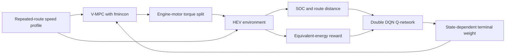

[Included paper PDF / 포함 논문 PDF](./Nonlinear_Model_Predictive_Control_for_Energy_Optimization_of_Hybrid_Electric_Vehicles_on_Repeated_Routes_via_Value_Function_Approximation.pdf)

[DOI](https://doi.org/10.1109/TTE.2026.3702242) · [Official research record / 공식 연구 레코드](https://research.knu.ac.kr/en/publications/nonlinear-model-predictive-control-for-energy-optimization-of-hyb/)

# Nonlinear Model Predictive Control for Energy Optimization of Hybrid Electric Vehicles on Repeated Routes via Value Function Approximation

> Paper companion research snapshot for value-function-augmented nonlinear model predictive control (V-MPC) and reinforcement-learning-based value-function approximation.
> 반복 주행 경로에서 value function을 결합한 nonlinear model predictive control(V-MPC)과 reinforcement learning 기반 value-function approximation을 살펴볼 수 있는 논문 동반 연구 스냅샷입니다.

| Item / 구분 | Value / 내용 |
| --- | --- |
| Authors / 저자 | Suyong Park, Solyeon Kwon, Youngki Kim, Kyoungseok Han |
| Venue / 게재지 | IEEE Transactions on Transportation Electrification |
| Publication status / 게재 상태 | 2026, Accepted / In press |
| DOI | [`10.1109/TTE.2026.3702242`](https://doi.org/10.1109/TTE.2026.3702242) |
| Artifact type / 아티팩트 유형 | Private paper companion research snapshot |
| Maintainer / 담당자 | Suyong Park / 박수용 |
| Inspection environment / 점검 환경 | MATLAB R2024b, static inspection only / 정적 점검만 수행 |
| Reference date / 문서 기준일 | 2026-08-31 |

> **Reproduction boundary / 재현 범위**
>
> The repository preserves paper-related MATLAB code, input files, a pretrained network, and historical workspace snapshots. It is **not** a turn-key replication package, and the paper's numerical results have not been reproduced from this repository snapshot.
>
> 이 저장소는 논문 관련 MATLAB 코드, 입력 파일, 사전 학습 network 및 과거 workspace snapshot을 보존합니다. 현재 상태는 **즉시 실행 가능한 전체 재현 패키지가 아니며**, 논문의 수치 결과를 이 저장소에서 다시 재현하지 않았습니다.

## Abstract / 초록

This work studies energy management for hybrid electric vehicles (HEVs) operating repeatedly on similar routes. Conventional nonlinear MPC can optimize engine-motor power distribution in real time, but its finite prediction horizon limits how much future route information it can use. The paper augments MPC with an approximated value function learned from repeated-route experience. A reinforcement-learning agent selects a terminal value parameter from state-of-charge (SOC) and route position, allowing the controller to account for longer-term battery and fuel usage while retaining MPC constraints.

본 연구는 유사한 경로를 반복 주행하는 hybrid electric vehicle(HEV)의 에너지 관리를 다룹니다. 일반적인 nonlinear MPC는 엔진과 모터의 동력 분배를 실시간으로 최적화할 수 있지만, 유한한 prediction horizon 때문에 장기 경로 정보를 충분히 반영하기 어렵습니다. 논문에서는 반복 경로 경험으로 학습한 approximated value function을 MPC에 결합합니다. Reinforcement-learning agent가 SOC와 경로 위치로 terminal value parameter를 선택하여, MPC의 제약 처리 능력을 유지하면서 장기적인 배터리·연료 사용을 함께 고려합니다.

## Introduction / 소개

Dynamic programming (DP) can provide a global benchmark when the complete driving trajectory is available, but that assumption is unsuitable for real-time control. MPC instead solves a shorter rolling-horizon problem, making it practical but potentially myopic. The proposed V-MPC uses a learned terminal value to evaluate the state reached at the end of the prediction horizon.

Dynamic programming(DP)은 전체 주행 궤적을 알고 있을 때 global benchmark를 제공하지만 실시간 제어에는 적용하기 어렵습니다. MPC는 짧은 rolling horizon 문제를 반복해서 풀기 때문에 실시간 적용이 가능하지만 장기 관점이 부족할 수 있습니다. 제안한 V-MPC는 prediction horizon 끝의 상태를 평가하는 학습 기반 terminal value를 추가합니다.

The repository is intended to help readers inspect that research structure: the space-domain HEV model, the `fmincon`-based nonlinear MPC environment, the Q-network training loop, the supplied MAT artifacts, and the boundary between the published method and this code snapshot.

이 저장소는 space-domain HEV model, `fmincon` 기반 nonlinear MPC environment, Q-network 학습 loop, 제공된 MAT artifact, 그리고 논문 방법과 현재 코드 snapshot의 차이를 독자가 확인할 수 있도록 구성했습니다.

## Method overview / 방법 개요

At route distance $d$, the reinforcement-learning state combines battery SOC and route position:

$$
s(d) =
\begin{bmatrix}
\mathrm{SOC}(d) \\
d
\end{bmatrix}.
$$

The learned policy selects a state-dependent terminal weight $\widehat{\lambda}(s)$. The paper-level value-function approximation is

$$
\widehat{V}\left(\mathrm{SOC}(d+N)\right) = \widehat{\lambda}(s)\left(\mathrm{SOC}(d+N)-\mathrm{SOC}_{f}\right).
$$

where $N$ is the prediction horizon and $\mathrm{SOC}_{f}$ is the target final SOC. V-MPC combines the finite-horizon fuel stage cost with this terminal value:

$$
\min_{u}
\left[
\sum_{k=0}^{N-1}
\Delta m_{f,d}\left(x(k\mid d),u(k\mid d)\right)
+
\widehat{V}\left(x(N\mid d)\right)
\right],
$$

subject to the vehicle, SOC, engine, motor, and control-input constraints described in the paper.

논문의 기본 흐름은 현재 SOC와 경로 위치를 RL state로 사용하고, Q-network가 terminal weight를 선택하며, V-MPC가 그 값을 목적함수에 반영해 엔진-모터 torque split을 계산하는 구조입니다.

### Conceptual paper workflow / 논문 개념 흐름



This diagram is a documentation-level summary. It does not assert that every paper experiment is packaged or executable here.

위 그림은 문서 수준의 개념 요약이며, 논문의 모든 실험이 이 저장소에 포함되거나 그대로 실행된다는 의미가 아닙니다.

## Repository layout / 저장소 구조

```text
Nonlinear-Model-Predictive-Control/
├─ README.md
├─ LICENSE
├─ .gitignore
├─ Nonlinear_Model_Predictive_Control_for_Energy_Optimization_of_
│  Hybrid_Electric_Vehicles_on_Repeated_Routes_via_Value_Function_
│  Approximation.pdf
├─ main.m
├─ QMPC_daily_main_feedforward_v2.m
├─ all_data.m
├─ net_udds.mat
├─ Input/
│  ├─ parameter.m
│  ├─ driving_hv1.mat
│  ├─ driving_hv*_info.mat
│  ├─ driving_hv*_info_space.mat
│  └─ driving_udds_info_space.mat
└─ Output/
   ├─ training_results.m
   ├─ epsilonDecay_30_all_data.mat
   ├─ epsilonDecay_60_all_data.mat
   └─ epsilonDecay_90_all_data.mat
```

The project-management sample documents under `docs/weekly-reports/` are intentionally not part of this paper repository.

과제 진행관리 예시였던 `docs/weekly-reports/` 문서는 논문 저장소에 포함하지 않습니다.

## Artifact guide / 아티팩트 안내

| Path / 경로 | Intended role / 의도된 역할 | Current status / 현재 상태 |
| --- | --- | --- |
| `QMPC_daily_main_feedforward_v2.m` | Double-DQN training loop around the V-MPC environment | Research snapshot; long-running training has not been rerun |
| `main.m` | Evaluation with a learned Q-network and nonlinear MPC | Provided, but not directly reproducible without resolving the issues below |
| `all_data.m` | Batch loader for repeated-route MAT inputs | References route files that are not all included |
| `Input/parameter.m` | HEV, battery, motor, engine, and MPC parameters | Loaded into the script workspace |
| `Input/*.mat` | Vehicle-model structures and interpolated driving profiles | Research inputs; not a curated public dataset |
| `net_udds.mat` | Supplied `dlnetwork` object | Present, while `main.m` currently requests `net.mat` |
| `Output/training_results.m` | Reward moving-average and confidence-band plot | Requires `res.rewards` in the active workspace |
| `Output/*.mat` | Historical full-workspace training snapshots | Reference only; not treated as reproduced results |
| Included PDF | Accepted/in-press paper copy available to authorized repository users | IEEE rights and redistribution restrictions remain applicable |

## Requirements / 요구 환경

The source code indicates the following MATLAB products:

- MATLAB R2024b was used for static inspection of this snapshot.
- Optimization Toolbox: `fmincon`, `optimoptions`.
- Deep Learning Toolbox: `dlnetwork`, `dlarray`, `dlfeval`, `adamupdate`, network layers, and `trainingProgressMonitor`.
- Statistics and Machine Learning Toolbox: `norminv` in `Output/training_results.m` only.

MATLAB's `requiredFilesAndProducts` static scan also reports System Identification Toolbox for `main.m`. That indirect dependency has not been isolated or confirmed through an end-to-end run, so readers should inspect their own environment rather than treating this list as a validated installation manifest.

MATLAB `requiredFilesAndProducts` 정적 분석은 `main.m`에 대해 System Identification Toolbox도 보고합니다. 이 간접 의존성은 end-to-end 실행으로 분리·확인하지 않았으므로, 위 목록을 검증된 설치 manifest로 해석하지 말고 각 환경에서 다시 확인해야 합니다.

The paper's real-time Autonomie validation, CarMaker driving-simulator setup, and associated hardware are not packaged in this repository. Loading the supplied MAT structures does not by itself reproduce those environments.

논문의 Autonomie 실시간 검증, CarMaker driving simulator 환경 및 관련 hardware는 이 저장소에 포함되어 있지 않습니다. 제공된 MAT 구조체를 불러오는 것만으로 해당 환경이 재현되지는 않습니다.

Inspect the local MATLAB installation before using the scripts:

```matlab
version
ver

which("fmincon", "-all")
which("dlnetwork", "-all")
which("norminv", "-all")
```

## Safe quick start / 안전한 시작

Clone the private repository with an account that has access:

```bash
git clone https://github.com/voicelab-hanyang/Nonlinear-Model-Predictive-Control.git
cd Nonlinear-Model-Predictive-Control
```

From the repository root, inspect the supplied artifacts without starting training or overwriting outputs:

```matlab
repoRoot = pwd;

% Inspect the pretrained network variable.
whos("-file", fullfile(repoRoot, "net_udds.mat"))

% Inspect representative input and historical output snapshots.
whos("-file", fullfile(repoRoot, "Input", "driving_hv1.mat"))
whos("-file", fullfile(repoRoot, "Output", "epsilonDecay_30_all_data.mat"))

% Run static code inspection only.
checkcode(fullfile(repoRoot, "main.m"), "-id")
checkcode(fullfile(repoRoot, "QMPC_daily_main_feedforward_v2.m"), "-id")
```

Do not treat a successful `load` or `checkcode` call as reproduction of the paper results. Review the known limitations before running either entry script.

MAT 파일 load나 `checkcode` 실행 성공은 논문 결과 재현을 의미하지 않습니다. 실행 전에 아래 제한사항과 데이터·network 조건을 먼저 검토하십시오.

## Reproduction status / 재현 상태

| Layer / 구분 | Availability / 제공 여부 | Verification / 검증 상태 |
| --- | --- | --- |
| Paper and DOI metadata | Included and linked | Cross-checked for documentation |
| MATLAB source snapshot | Included | Static inspection only |
| Input MAT artifacts | Included | Variable inventory inspected; scientific provenance not revalidated |
| Pretrained Q-network | `net_udds.mat` included | File inventory inspected; evaluation path not executed |
| Historical training workspaces | Three `Output/*.mat` files included | Reference snapshots only |
| Offline DP/MPC/V-MPC comparison | Not packaged as an end-to-end experiment | Paper-reported values only |
| Real-time Autonomie validation | Model and platform not included | Not reproducible from this repository alone |
| Automated tests or CI | Not provided | No pass claim |

## Known limitations / 알려진 제한사항

- `main.m` executes `load net`, but the supplied network file is `net_udds.mat`.
- After predicting an action from the network, `main.m` currently overwrites it with `action = -100` under a `TO DO` marker. This value is outside the configured `-42:-0.5:-49` action grid.
- `all_data.m` requests `driving_hv1_info_space` through `driving_hv10_info_space`, while `hv4` through `hv9` are absent.
- `QMPC_daily_main_feedforward_v2.m` is configured for 1,000 episodes and writes `net.mat`; it has not been rerun as part of this publication.
- The method equations above summarize the paper formulation. Both supplied `costfunc` implementations add the value-weighted SOC term at every prediction step, rather than packaging the paper's single horizon-terminal term line for line.
- The training snapshot uses a target-network maximum, a hard target-network copy every four episodes, and a code-level reward that differ from the DDQN target, soft update, and reward formulation presented in the paper.
- The paper's distance-threshold quadratic fallback is not faithfully represented in `main.m` because the subsequent `action = -100` assignment overrides the selected value in both branches.
- The filenames and saved settings of the historical Output MAT snapshots do not fully match the current training-script settings. They cannot establish byte-for-byte or numerical reproducibility.
- `Output/training_results.m` is an analysis helper that assumes `res.rewards` already exists in the MATLAB workspace.
- The MAT files preserve broad simulator and training workspace structures rather than a minimized, portable dataset.
- No automated test suite, deterministic reproduction script, CI workflow, or supported public API is provided.

These limitations are documented instead of silently altering the research code. A future reproducibility release should version the exact input set, network, hyperparameters, solver configuration, random seeds, and expected outputs together.

위 제한사항은 연구 코드를 임의로 수정하지 않고 현재 상태를 정확히 설명하기 위해 명시했습니다. 향후 재현성 release에서는 정확한 입력 묶음, network, hyperparameter, solver 설정, random seed 및 예상 출력을 함께 versioning해야 합니다.

## Paper-reported results / 논문 보고 결과

The values below are transcribed from the paper and are **not regression-test results from this repository**.

아래 수치는 논문에 보고된 값이며 **이 저장소에서 다시 실행한 regression-test 결과가 아닙니다**.

| Evaluation / 평가 | Baseline / 기준 | Paper-reported result / 논문 보고값 | Repository status / 저장소 상태 |
| --- | --- | --- | --- |
| Offline repeated-route scenarios | Optimal DP | Conventional MPC used `7.22–10.24%` more fuel than DP | Not rerun here |
| Offline repeated-route scenarios | Optimal DP | V-MPC used `3.15–5.70%` more fuel than DP | Not rerun here |
| Seven-day real-time simulation | Rule-based control | V-MPC reduced total fuel consumption by approximately `3.96%` | Autonomie setup not included |

These results support the paper's conclusions under its reported experiment conditions. They must not be generalized to other vehicles, routes, traffic conditions, models, or implementations without a separate validation study.

이 결과는 논문에 명시된 실험 조건에서의 결론을 뒷받침합니다. 별도 검증 없이 다른 차량, 경로, 교통 조건, 모델 또는 구현의 성능으로 일반화해서는 안 됩니다.

## Citation / 인용

If this paper or repository informs your work, cite the paper using its DOI:

```bibtex
@article{Park2026VMPC,
  author  = {Suyong Park and Solyeon Kwon and Youngki Kim and Kyoungseok Han},
  title   = {Nonlinear Model Predictive Control for Energy Optimization of
             Hybrid Electric Vehicles on Repeated Routes via Value Function
             Approximation},
  journal = {IEEE Transactions on Transportation Electrification},
  year    = {2026},
  doi     = {10.1109/TTE.2026.3702242},
  note    = {Accepted/In press}
}
```

Use the DOI record for the latest volume, issue, page, and publication-status metadata.

최종 volume, issue, page 및 게재 상태는 DOI 레코드의 최신 정보를 기준으로 확인하십시오.

## Code license, data, and copyright / 코드 라이선스·데이터·저작권

The MIT License in [`LICENSE`](./LICENSE) applies **only to MATLAB source files with the `.m` extension** in this repository.

[`LICENSE`](./LICENSE)의 MIT License는 이 저장소의 **`.m` 확장자 MATLAB source file에만** 적용됩니다.

The MIT grant does not apply to MAT files, the included IEEE paper PDF, this README, or other documentation. The MAT files are supplied as research artifacts without a separate reuse grant. The included PDF remains subject to IEEE copyright and access restrictions and must not be redistributed outside authorized repository access.

MIT 권한은 MAT 파일, 포함된 IEEE 논문 PDF, 이 README 또는 기타 문서에는 적용되지 않습니다. MAT 파일은 별도 재사용 권한이 없는 연구 artifact로 제공됩니다. 포함된 PDF에는 IEEE 저작권과 접근 제한이 계속 적용되며, 저장소 접근 권한이 없는 외부로 재배포해서는 안 됩니다.
